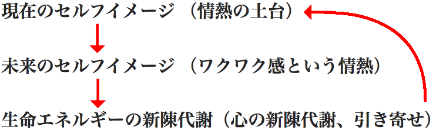

##「情熱サイクル」　心の新陳代謝

膨大な知恵、膨大なアイデアを徹底的に整理整頓してみると、たった**３つの概念**に落とし込まれます。
###１．現在のセルフイメージ
###２．未来のセルフイメージ
###３．生命エネルギーの新陳代謝
の３つです。

もっと絞り込むならば、**セルフイメージ**と**生命エネルギー**の２つだけです。

**セルフイメージ**とは、「自分とはこういう人だ」という、皆が無意識に抱きながら普段生活しているイメージのことです。

**生命エネルギー**とは、その名の通りのことなのですが、**セルフイメージ**と併せて、これから、このサイトでじっくりと説明していきましょう。

このサイトでは、この2つ、あるいはもう少し細かくわけて、この３つの事柄についてだけ延々とお話していきます。

そして、私達はより良い方向へ向かいたいという大前提、流れの方向を予め見定め、見失わないため、常に意識するために、
###情熱
に着目します。

これは何も「最初にまず情熱が必要なんですよ！」ということではなく、
###１．現在のセルフイメージ
###２．未来のセルフイメージ
###３．生命エネルギーの新陳代謝
が、**１→２→３**の順番に好循環すると自然に出てくるものなのです。

この**１→２→３の好循環**のことを
###情熱サイクル
と呼ぶことにしましょう。

**情熱サイクルは、情熱の循環です。**

この世の中のすべてのものごとはすべて循環しています。
水の循環、血液の循環、命の循環、「万物流転」と言われたりします。

循環でも、古いものを捨て去り、新しいものを取り入れる循環のことを特に**新陳代謝**と言います。
###情熱サイクルは情熱の循環であり、心の新陳代謝です。
**情熱サイクル**は**人生の成功**や**ブレイクスルー**というものに焦点を当て研究する**成功哲学**で、**情熱**という概念を基盤にします。人間の行動を科学的に研究し法則性を解明しようとする行動科学と強い関連があり、心理学、脳科学、経営哲学、スピリチュアリズムなどの知見を参照し利用します。

ちなみに、このサイトは、情熱サイクルの成果物で、心の赴くままやっていたら、なんの苦労もなく自動的に出来上がりました。

今ここでは、情熱サイクルの全体像を俯瞰しました。
さてここからは、この情熱サイクルの中身がどのように循環していくのか？
####１．現在のセルフイメージ
####２．未来のセルフイメージ
####３．生命エネルギーの新陳代謝
を順番に見ていきましょう。

そして後半では、この３つの事柄を軸にしながら延々と実例を参照していき理解を深めていきます。

##[現在のセルフイメージ①　すべての成功法則の根源はここにある](/contents/entry2/entry.html)　に進む

##▲[もくじ](/contents/a_index/entry.html)